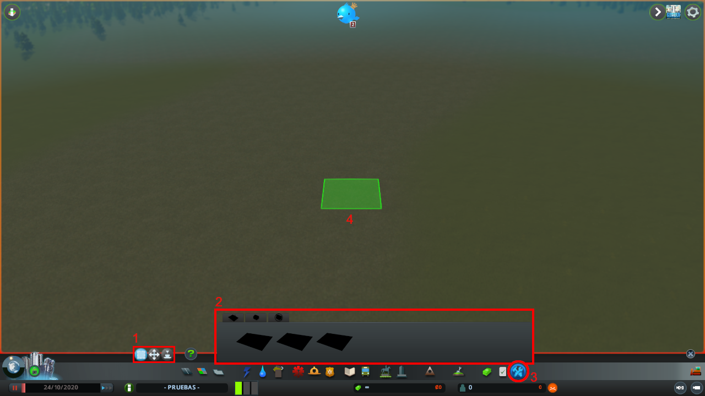
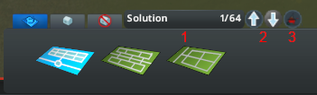

# IndustryLP for Cities: Skylines®

<p align="center"> <a href="https://dotnet.microsoft.com/download/dotnet-framework/net35"></a> <a href="https://store.steampowered.com/app/255710/Cities_Skylines/"></a> <a href="https://github.com/NEKERAFA/CS-IndustryLP/blob/master/LICENSE"></a> <a href="https://tree.taiga.io/project/nekerafa-tfm-udc/"></a> </p>

 <a href="https://github.com/NEKERAFA/CS-IndustryLP/releases"></a> <a href="https://steamcommunity.com/sharedfiles/filedetails/?id=2597556943"></a>

An Industrial Estate Generator Mod for the Videogame 'Cities: Skylines®' using Logic Programming (Answer Set Programming).

## Abstract

This project is included, together with [ClingoSharp](https://github.com/NEKERAFA/ClingoSharp), in my final project of my master's degree in computer engineering. The objective is to partially automating the urban planning of industrial parks in a simulation video game by means of automatic reasoning and knowledge representation techniques. For this purpose, a declarative tool governed by rules has been built to generate the framework of the industrial estate and whose output can be used by the city simulator 'Cities: Skylines®'.

## Dependencies

- [.NET Framework 3.5](https://www.microsoft.com/es-es/download/details.aspx?id=21)
- [ClingoSharp](https://github.com/NEKERAFA/ClingoSharp)

*Optional*
- [Ploppable RICO *Revisited*](https://github.com/algernon-A/Ploppable-RICO-Revisited)

## Instalation

You can get the mod in the [Steam Workshop](https://steamcommunity.com/sharedfiles/filedetails/?id=2597556943): https://steamcommunity.com/sharedfiles/filedetails/?id=2597556943.

If you get the game with another service, you can download the lastest zip file in [release](https://github.com/NEKERAFA/CS-IndustryLP/releases) section of this page. You must uncompress the file in ```%User local data folder% / Colossal Order / Cities_Skylines / Addons / Mods```.

In this moment, **IndustryLP only works on Microsoft Windows**. To make it works on another OS, you have to build the [clingo](https://github.com/potassco/clingo) dependency on your system and place it in the folder ```runtimes / os / native```.

## Building

You must have .NET Framework installed on your computer. Download this repo with all submodules and compile the IndustryLP solution.

## How to use

The main UI has been divided into the sections below:



1. **Actions**: Define region, modify region and generate.
2. **Main panel** with Distributions, Preferences and Restrictions tabs.
3. **Main tool**
4. **Tool cursor**

For defining a region, you have to hold pressed the primary mouse button in any part of the terrain. If the region has enough size, the selection will have orange color, otherwise the selection will be red and when you released the button, it will be errased.

With a region defined, in **modify region** you can change the size if you hold pressed the primary mouse button in any vertex of the region. To move it you must to do the same in the middle point, and to rotate the area you have to press the secondary mouse button and move the cursor.


Once the region has been made, you must to select any road distribution to tell the generation how to put the industrial buildings. With a distribution selected, you could add building restrictions in any parcel.

If you add a preference, IndustryLP will understand that you want that building to be generated at that given position. On the other hand, if you add a restriction, the mod will understand that you don't want such buildings to be generated in that region.

For remove a restriction, you have to press the secondary mouse button in the building that you want to erase.

When you want to generate solutions, you must to press the **generate** action. A dialog window will be shown. In this dialog you can change the maximun number of solutions that the mod will show (0 returns all the possible solutions).


Another editable option is to add new rules in [**ASP Core 2**](https://www.mat.unical.it/aspcomp2013/files/ASP-CORE-2.03b.pdf) format that they will be used in the generation process. For generate the possible solutions we use [clingo](https://github.com/potassco/clingo) tool to compute the *answer sets* of a *logic program*. All the logic program rules are store in ```.lp``` files in [```DomianDefinition / logic_program```](IndustryLP/DomainDefinition/logic_program) folder.

Any new ```.lp``` file will be loaded in the generation process on the fly, so you can test you rules in the **Advanced Edition** text area and then pass to a file to save it in future generations.

Once you press *Generate* button, the main panel will change, adding the following sections:



1. Current solution index / Number of solutions found.
2. Buttons to change previous / next solution.
3. Build actual solution.

The main solution will be shown in the region selected. When you build a solution, all the roads and buildings will be created in Cities: Skylines®. 

> **NOTE:** If you haven't any mod installed that prevents new building from being removed of the simulation if the area is not zoning with these building type, all the buildings generated will be buldoze because this. For preventing it, my recommendation is to use [Ploppable RICO Revised](https://github.com/algernon-A/Ploppable-RICO-Revisited) or any similar mod.

# License

> MIT License
>
> Copyright (c) 2019 Rafael Alcalde Azpiazu
>
> Permission is hereby granted, free of charge, to any person obtaining a copy
> of this software and associated documentation files (the "Software"), to deal
> in the Software without restriction, including without limitation the rights
> to use, copy, modify, merge, publish, distribute, sublicense, and/or sell
> copies of the Software, and to permit persons to whom the Software is
> furnished to do so, subject to the following conditions:
>
> The above copyright notice and this permission notice shall be included in all
> copies or substantial portions of the Software.
>
> THE SOFTWARE IS PROVIDED "AS IS", WITHOUT WARRANTY OF ANY KIND, EXPRESS OR
> IMPLIED, INCLUDING BUT NOT LIMITED TO THE WARRANTIES OF MERCHANTABILITY,
> FITNESS FOR A PARTICULAR PURPOSE AND NONINFRINGEMENT. IN NO EVENT SHALL THE
> AUTHORS OR COPYRIGHT HOLDERS BE LIABLE FOR ANY CLAIM, DAMAGES OR OTHER
> LIABILITY, WHETHER IN AN ACTION OF CONTRACT, TORT OR OTHERWISE, ARISING FROM,
> OUT OF OR IN CONNECTION WITH THE SOFTWARE OR THE USE OR OTHER DEALINGS IN THE
> SOFTWARE.